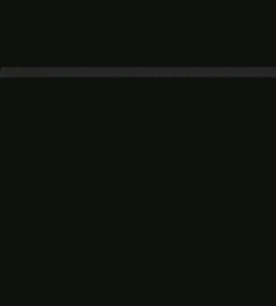
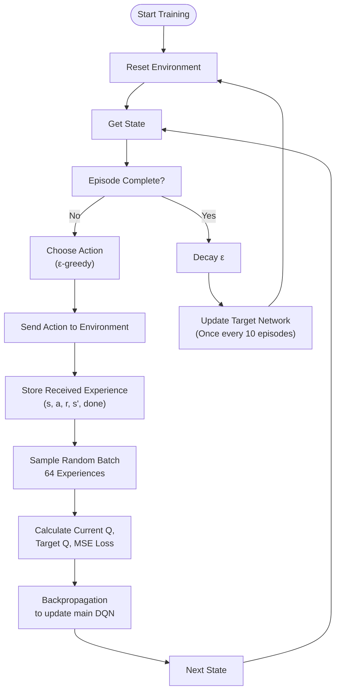
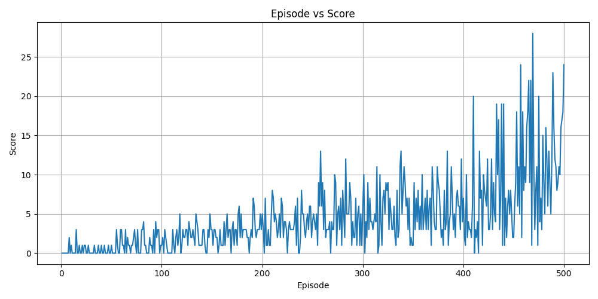
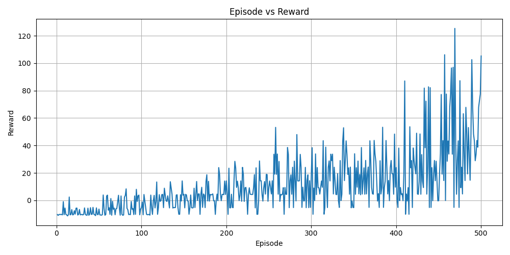

# Snake DQN Agent

A **Deep Q-Learning Network (DQN) agent** written in **Python and PyTorch** that learns to play a Snake game.

The Snake game is implemented separately in **C**. This repository contains the **Reinforcement Learning agent**, training logic, and the Python interface used to communicate with the C environment through `stdin`/`stdout`.



### Related Repository: [Snake Game Environment](https://github.com/docot04/snake-environment)

## Usage

First, clone and build the [C Snake environment](https://github.com/docot04/snake-environment) from its repository. The trained agent expects the Snake executable to be available as `./snake` placed in [**/src**](./src).

Then clone this repository:

```
git clone https://github.com/docot04/snake-ai.git
cd src
```

Install the Python dependencies:

```
pip install -r requirements.txt
```

To train a new agent (use flag `--headless` to run training loop without rendering the game):

```
python main.py train model.pth
```

To test a trained model (the final value (delay) controls how fast the actions are performed):

```
python main.py test model.pth 0.1
```

## Project Structure

- [**agent.py**](./src/agent.py): RL agent (`DQN`, `ReplayBuffer`, `Agent`), responsible for
  - Neural network
  - Action selection
  - Experience replay
  - DQN training
  - Target network updates
  - Model saving/loading
- [**env.py**](./src/env.py): Interface to the C environment, responsible for:
  - starting the C process
  - sending actions
  - receiving observations
  - resetting and closing environment
- [**main.py**](./src/main.py): Command-line entry point for training and testing
- [**model.py**](./src/model.py): Training and Testing loops

## Reinforcement Learning

### 1. State Representation

The agent receives the following **11 binary element state vector**, to be used as the observation for RL model:

[`danger_straight`, `danger_left`, `danger_right`, `food_up`, `food_down`, `food_left`, `food_right`, `direction_up`, `direction_down`, `direction_left`, `direction_right`]

### 2. Action Space

The agent can choose between **3 actions**: `0` (straight), `1` (left), `2` (right), which are relative to the snake's current direction to allow the same action representation to work regardless of the snake's current orientation.

### 3. Reward Function

The Rewards are managed by the C-environment and sent with each state update

- **Eat food** : `+5.0`
- **Normal Movement** : `-0.01` (encourages the agent to make progress rather than endlessly moving without eating food)
- **Death** : `-10.0`

### 4. Neural Network

The agent uses a fully connected neural network to approximate the Q function, with these layers: `Input[11]`, `Hidden1[128]`, `Hidden2[128]`, `Output[3]`. During exploitation, the action with the highest Q-value is selected.

### 5. Q-function approximation

The agent attempts to learn the optimal action-value function using the **Bellman Optimality Equation**:

$$
Q(s, a) = R(s, a) + \gamma \max_{a'} Q(s', a')
$$

where:

- $Q(s, a)$ is the expected total reward for taking action $a$ in state $s$.
- $R(s, a)$ is the immediate reward received after taking action $a$ in state $s$.
- $\gamma$ is the discount factor ($0 \le \gamma < 1$).
- $s'$ is the next state resulting from the action.
- $a'$ is the next possible action in state $s'$.

### 6. Experience Replay

Every interaction with the environment produces an experience `(state, action, reward, next_state, done)` stored in a replay buffer with a capacity of **100000 experiences**. Instead of training only on the most recent experience, the agent randomly samples a batch of **64 experiences**. This helps reduce correlations between consecutive experiences and allows the agent to learn from previous situations multiple times.

### 7. Target Network

Two DQN networks are maintained to stabilize the Q-learning updates:

1. **Main Network:**
   - Selects actions
   - Trained after each step
   - Has its weights updated by backpropagation

2. **Target Network:**
   - Calculates the target Q-values
   - Not updated every training step
   - Receives a copy of the main network's weights every **10 episodes**

### 8. Epsilon-Greedy Exploration strategy

Initially `ε = 1.0` so the agent heavily explores random actions. After every episode `ε = ε * decay` until it reaches the minimum `ε = 0.05`. The policy therefore gradually transitions from **exploration** toward **exploitation**.

During testing, exploration is disabled (`ε = 0`) so the trained agent always selects the action with the highest predicted Q-value.

### 9. Hyperparameters

```
State size        : 11
Action size       : 3
Hidden layers     : 2
Hidden layer size : 128
Learning rate     : 0.001
Discount factor   : 0.99
Initial epsilon   : 1.0
Minimum epsilon   : 0.05
Epsilon decay     : 0.995
Replay buffer     : 100000
Batch size        : 64
Target update     : Every 10 episodes
Training episodes : 500
Testing episodes  : 10
Optimizer         : Adam
Loss function     : MSE
```

### 10. Complete Training Loop



## Results

### Training

The DQN agent was trained for **500 episodes** using the hyperparameters described above. The following plots show the agent's performance throughout training.



As training progresses, the agent begins to achieve higher scores and survive for longer periods, indicating that it is learning a useful policy for navigating the environment and reaching food.



Changes in the reward over time reflect the agent's progression from exploratory behavior toward a more learned policy.

### Testing

After training, the saved model was evaluated for **10 episodes** with exploration disabled (`ε = 0`)

- **Average score:** `33.30`
- **Best score:** `77` _(shown [here](./assets/demo.gif))_
- **Worst score:** `6`

## Contributors

- [**Dixit**](https://github.com/docot04)
- [**Manjima**](https://github.com/thatmomfrnd)
